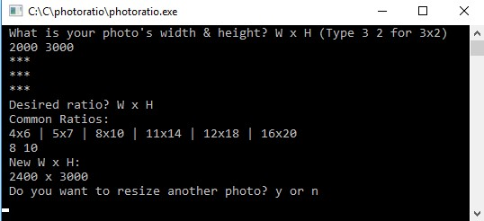

# Photo Ratio
## Resize photo for a different aspect ratio

Do you want to print your photos anywhere and not have it cropped? Most modern DSLRs take photos in a 2x3 ratio, but most printing centers print in other ratios (e.g. 8x10). To avoid cropping of a photo, it is important to resize the photo beforehand.

This program will find the required photo resolution for a specific aspect ratio.

If your photo resolution is 2000x3000 (2x3 ratio), and you want 8x10 ratio, the new resolution would be 2400x3000.

## Installation

Use a compiler such as Visual Studio's Developer command prompt. Assuming interp.c is in the folder, `C:/photoratio`, you would use this:
```
cd c:/photoratio
cl photoratio.c
```

## Running the Program
After compiling the code, you can run the program on the command prompt or open the exe file.


The program runs in a while loop, so you can run the interpolation code as many times as you'd like without restarting the program.

When you are ready to exit the program, enter `n` (for no) when the program asks if you want to resize another photo.
